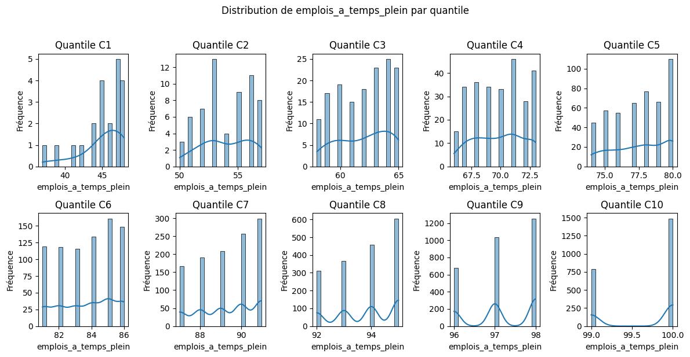

# 📊 Analyse du Pourcentage Moyen d'Emplois à Temps Plein par Catégorie de Taux de Réponse

Cette analyse examine le pourcentage moyen d'emplois à temps plein parmi les diplômés employés, au sein de chaque catégorie de taux de réponse (C1 à C10). Les résultats mettent en évidence la progression de l'accès à l'emploi à temps plein en fonction du taux de participation à l'enquête.

-----

## 🔢 Données statistiques

**Tableau des indicateurs par catégorie :**

| Catégorie | Observations | Moyenne | Médiane | Minimum | Maximum |
|-----------|--------------|---------|---------|---------|---------|
| C1        | 21           | 45.0%   | 46.0%   | 37.0%   | 48.0%   |
| C2        | 61           | 54.0%   | 54.0%   | 50.0%   | 57.0%   |
| C3        | 151          | 62.0%   | 62.0%   | 58.0%   | 65.0%   |
| C4        | 267          | 69.8%   | 70.0%   | 66.0%   | 73.0%   |
| C5        | 475          | 77.5%   | 78.0%   | 74.0%   | 80.0%   |
| C6        | 797          | 83.7%   | 84.0%   | 81.0%   | 86.0%   |
| C7        | 1,120        | 89.3%   | 89.0%   | 87.0%   | 91.0%   |
| C8        | 1,738        | 93.8%   | 94.0%   | 92.0%   | 95.0%   |
| C9        | 2,967        | 97.2%   | 97.0%   | 96.0%   | 98.0%   |
| C10       | 2,272        | 99.7%   | 100.0%  | 99.0%   | 100.0%  |

*Note : Ce pourcentage représente la part des emplois à temps plein parmi les diplômés ayant un emploi, regroupés par catégorie de taux de réponse à l'enquête.*

-----

## 🎯 Principaux constats

### 1\. Progression marquée du pourcentage moyen d'emplois à temps plein par catégorie

  - **Augmentation substantielle** du pourcentage moyen d'emplois à temps plein de la catégorie C1 (45.0%) à la catégorie C10 (99.7%).
  - **Progression régulière et significative** entre chaque catégorie.

### 2\. Nombre d'observations croissant avec l'augmentation de la catégorie (jusqu'à C9)

  - **Nombre d'observations faible** dans les premières catégories (C1 et C2).
  - **Forte concentration** des observations dans les catégories supérieures (C8, C9, C10), indiquant une meilleure représentativité pour les établissements ayant un taux de réponse élevé.

### 3\. Faible étendue du pourcentage au sein de chaque catégorie

  - **Étendue relativement limitée** du pourcentage d'emplois à temps plein au sein de chaque catégorie (environ 3 à 6 points), suggérant une certaine homogénéité pour les établissements ayant des taux de réponse similaires.

-----

## 🏫 Implications méthodologiques

### Pour l'interprétation du type d'emploi

  - **Les établissements avec un faible taux de réponse (C1) présentent un pourcentage d'emplois à temps plein moyen significativement plus bas.** Cela suggère que leurs diplômés sont plus susceptibles d'occuper des emplois à temps partiel ou d'avoir des difficultés à accéder à un emploi à temps plein.
  - **Le pourcentage d'emplois à temps plein augmente de manière constante et significative avec le taux de réponse des établissements**, indiquant un lien positif entre la participation à l'enquête et la qualité de l'emploi en termes de temps de travail.

### Pour les politiques d'accompagnement

  - **Analyser les facteurs qui contribuent à un faible accès à l'emploi à temps plein pour les diplômés des établissements de la catégorie C1.**
  - **Identifier les meilleures pratiques des établissements des catégories supérieures pour favoriser l'accès à l'emploi à temps plein.**

-----

## 📈 Visualisation recommandée

*Fig. 1 - Graphique en barres montrant la progression du pourcentage moyen d'emplois à temps plein par catégorie de taux de réponse.*
 

-----

## 🔍 Pistes d'approfondissement

1.  **Analyse des secteurs d'activité** :

      - Y a-t-il des secteurs spécifiques qui emploient plus à temps partiel dans les catégories inférieures ?

2.  **Étude des niveaux de qualification** :

      - Le niveau de qualification des emplois à temps plein varie-t-il selon la catégorie de taux de réponse ?

3.  **Comparaison avec le taux d'emplois stables** (tableau précédent) :

      - Y a-t-il une corrélation entre l'accès à un emploi à temps plein et la stabilité de cet emploi selon la catégorie ?

-----

### 💡 Insight clé

Ce tableau met en évidence une **forte corrélation positive entre le taux de réponse des établissements et le pourcentage moyen d'emplois à temps plein de leurs diplômés**. Les établissements qui obtiennent une bonne participation à leurs enquêtes semblent également mieux préparer leurs diplômés à accéder à des emplois à temps plein. L'écart important observé dès la catégorie C1 souligne l'importance de considérer le type de contrat comme un indicateur essentiel de l'insertion professionnelle.
