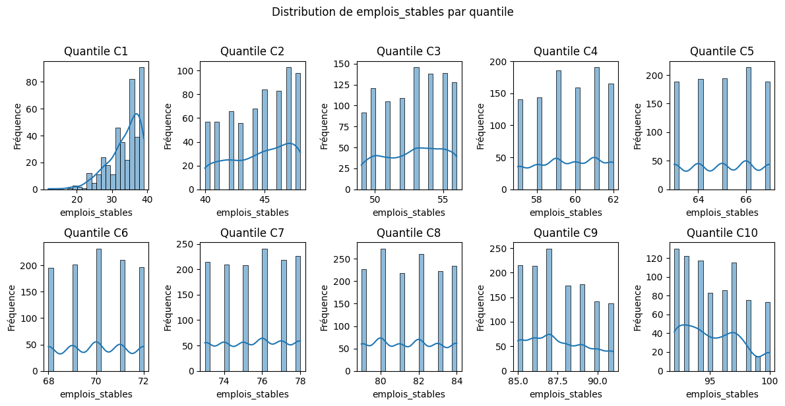

# 📊 Analyse du Pourcentage Moyen d'Emplois Stables par Catégorie de Taux de Réponse

Cette analyse examine le pourcentage moyen d'emplois stables parmi les diplômés employés, au sein de chaque catégorie de taux de réponse (C1 à C10). Les résultats mettent en évidence la progression de la stabilité de l'emploi en fonction du taux de participation à l'enquête.

-----

## 🔢 Données statistiques

**Tableau des indicateurs par catégorie :**

| Catégorie | Observations | Moyenne | Médiane | Minimum | Maximum |
|-----------|--------------|---------|---------|---------|---------|
| C1        | 405          | 33.5%   | 35.0%   | 12.0%   | 39.0%   |
| C2        | 672          | 44.5%   | 45.0%   | 40.0%   | 48.0%   |
| C3        | 978          | 52.7%   | 53.0%   | 49.0%   | 56.0%   |
| C4        | 986          | 59.6%   | 60.0%   | 57.0%   | 62.0%   |
| C5        | 979          | 65.0%   | 65.0%   | 63.0%   | 67.0%   |
| C6        | 1,038        | 70.0%   | 70.0%   | 68.0%   | 72.0%   |
| C7        | 1,319        | 75.5%   | 76.0%   | 73.0%   | 78.0%   |
| C8        | 1,436        | 81.5%   | 81.5%   | 79.0%   | 84.0%   |
| C9        | 1,306        | 87.7%   | 87.0%   | 85.0%   | 91.0%   |
| C10       | 816          | 95.3%   | 95.0%   | 92.0%   | 100.0%  |

*Note : Ce pourcentage représente la part des emplois stables parmi les diplômés ayant un emploi, regroupés par catégorie de taux de réponse à l'enquête.*

-----

## 🎯 Principaux constats

### 1\. Progression notable du pourcentage moyen d'emplois stables par catégorie

  - **Augmentation significative** du pourcentage moyen d'emplois stables de la catégorie C1 (33.5%) à la catégorie C10 (95.3%).
  - **Progression relativement régulière** entre les catégories, avec une accélération dans les dernières.

### 2\. Distribution des observations assez homogène entre les catégories

  - **Nombre d'observations important** dans toutes les catégories, ce qui renforce la robustesse des statistiques.

### 3\. Faible étendue du pourcentage au sein de chaque catégorie

  - **Étendue relativement limitée** du pourcentage d'emplois stables au sein de chaque catégorie (environ 4 à 6 points), suggérant une certaine homogénéité pour les établissements ayant des taux de réponse similaires.

-----

## 🏫 Implications méthodologiques

### Pour l'interprétation de la stabilité de l'emploi

  - **Les établissements avec un faible taux de réponse (C1) présentent un pourcentage d'emplois stables moyen significativement plus bas.** Cela indique une plus grande proportion d'emplois potentiellement précaires pour leurs diplômés.
  - **Le pourcentage d'emplois stables augmente de manière constante avec le taux de réponse des établissements**, suggérant un lien positif entre la participation à l'enquête et la stabilité de l'emploi des diplômés.

### Pour les politiques d'insertion

  - **Identifier les pratiques des établissements des catégories supérieures (C8, C9, C10) qui favorisent la stabilité de l'emploi.**
  - **Mettre en place des mesures spécifiques pour accompagner les diplômés des établissements de la catégorie C1 vers des emplois plus stables.**

-----

## 📈 Visualisation recommandée

*Fig. 1 - Graphique en barres montrant la progression du pourcentage moyen d'emplois stables par catégorie de taux de réponse.*
 

-----

## 🔍 Pistes d'approfondissement

1.  **Définition précise de ce qui constitue un "emploi stable"** :

      - Quels types de contrats sont inclus ? (CDI, CDD de longue durée, etc.)

2.  **Analyse de corrélation** :

      - Existe-t-il une forte corrélation entre le taux de réponse, le taux d'insertion et le pourcentage d'emplois stables ?

3.  **Étude des facteurs influençant la stabilité** :

      - Secteurs d'activité prédominants par catégorie d'établissement.
      - Niveau de qualification des emplois stables.

-----

### 💡 Insight clé

Ce tableau confirme une **forte association positive entre le taux de réponse des établissements et le pourcentage moyen d'emplois stables de leurs diplômés**. Les établissements qui obtiennent une bonne participation à leurs enquêtes semblent également favoriser l'accès de leurs diplômés à des emplois plus stables. L'écart important entre la catégorie C1 et les catégories supérieures souligne l'importance de considérer la stabilité de l'emploi comme un indicateur clé de la qualité de l'insertion professionnelle.
