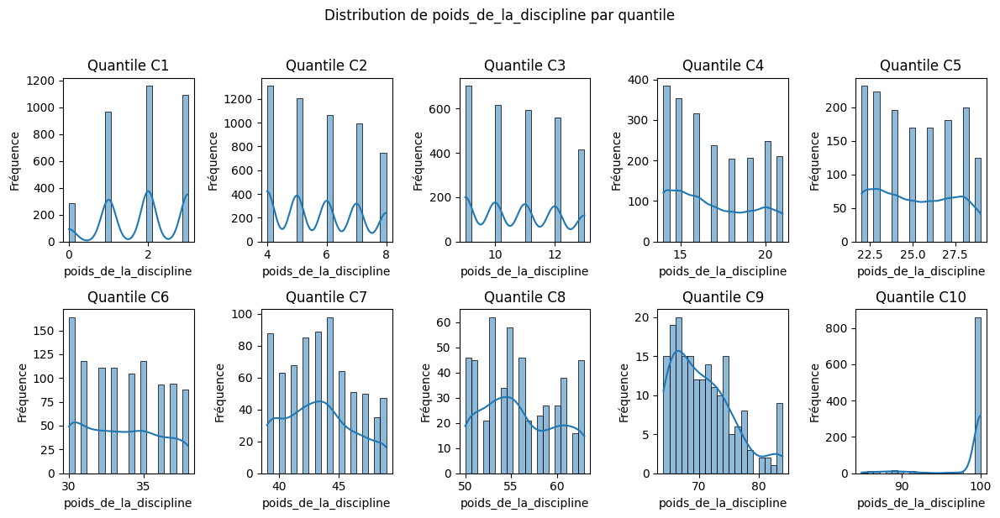

Parfait, voici l'analyse de ce second tableau, toujours au format Markdown :

# 📊 Analyse du Poids Moyen des Disciplines par Catégorie de Taux de Réponse

Cette analyse examine le poids moyen des disciplines au sein de chaque catégorie de taux de réponse (C1 à C10). Les résultats mettent en lumière la distribution des observations et les valeurs extrêmes du poids des disciplines par catégorie.

-----

## 🔢 Données statistiques

**Tableau des indicateurs par catégorie :**

| Catégorie | Observations | Moyenne | Médiane | Minimum | Maximum |
|-----------|--------------|---------|---------|---------|---------|
| C1        | 350          | 1.87    | 2.00    | 0.0     | 3.0     |
| C2        | 532          | 5.75    | 6.00    | 4.0     | 8.0     |
| C3        | 288          | 10.78   | 11.00   | 9.0     | 13.0    |
| C4        | 216          | 17.01   | 17.00   | 14.0    | 21.0    |
| C5        | 149          | 25.19   | 25.00   | 22.0    | 29.0    |
| C6        | 100          | 33.60   | 33.00   | 30.0    | 38.0    |
| C7        | 73           | 43.37   | 43.00   | 39.0    | 49.0    |
| C8        | 50           | 55.92   | 55.00   | 50.0    | 63.0    |
| C9        | 19           | 70.46   | 70.00   | 64.0    | 84.0    |
| C10       | 95           | 99.00   | 100.00  | 85.0    | 100.0   |

*Note : Le poids de la discipline est une métrique dont l'unité n'est pas précisée ici, mais qui est distribuée au sein de chaque catégorie de taux de réponse.*

-----

## 🎯 Principaux constats

### 1\. Progression du poids moyen des disciplines par catégorie

  - **Tendance générale à l'augmentation** du poids moyen des disciplines de C1 à C10.
  - **Écart important** entre la moyenne de C1 (1.87) et celle de C10 (99.00).

### 2\. Nombre d'observations décroissant avec l'augmentation de la catégorie

  - **Forte concentration** des observations dans les premières catégories (C1 et C2).
  - **Nombre d'observations très faible** dans les dernières catégories (C9 et C10).

### 3\. Étendue des poids de discipline au sein des catégories

  - **Faible étendue** dans les premières catégories (C1, C2, C3), suggérant une certaine homogénéité du poids des disciplines pour les établissements ayant de faibles taux de réponse.
  - **Étendue plus importante** dans les catégories supérieures, indiquant une plus grande variabilité du poids des disciplines pour les établissements ayant des taux de réponse élevés. Notamment, C9 présente une étendue significative (20 points).

-----

## 🏫 Implications méthodologiques

### Pour l'interprétation des catégories

  - **La taille des échantillons par catégorie est très variable**, ce qui peut impacter la robustesse des statistiques, en particulier pour C9 et C10.
  - **La nature du "poids de la discipline"** doit être clairement définie pour une interprétation significative des résultats.

### Pour l'analyse des taux de réponse

  - **Il semble y avoir une relation entre le taux de réponse des établissements et la distribution du poids de leurs disciplines.** Les établissements avec des taux de réponse plus élevés semblent présenter une plus grande dispersion dans le poids de leurs disciplines.

-----

## 📈 Visualisation recommandée

*Fig. 1 - Graphique en barres montrant la progression du poids de la discipline par catégorie*
  
-----

## 🔍 Pistes d'approfondissement

1.  **Définition et signification du "poids de la discipline"** :

      - Quelle est l'unité de mesure ?
      - Que représente concrètement un poids élevé ou faible ?

2.  **Analyse de la corrélation** :

      - Existe-t-il une corrélation significative entre le poids moyen des disciplines et le taux de réponse moyen par catégorie ?

3.  **Étude des établissements extrêmes** :

      - Examiner les caractéristiques des établissements avec des poids de discipline minimum et maximum au sein de chaque catégorie.

-----

### 💡 Insight clé

Ce tableau révèle une **tendance à l'augmentation du poids moyen des disciplines** à mesure que la catégorie de taux de réponse s'élève. Cependant, la **diminution drastique du nombre d'observations** dans les catégories supérieures appelle à la prudence dans l'interprétation des moyennes. De plus, l'**étendue croissante du poids des disciplines** suggère que les établissements avec des taux de réponse élevés peuvent avoir des structures disciplinaires plus variées en termes de ce "poids". Une compréhension claire de ce que représente le "poids de la discipline" est cruciale pour tirer des conclusions significatives.
