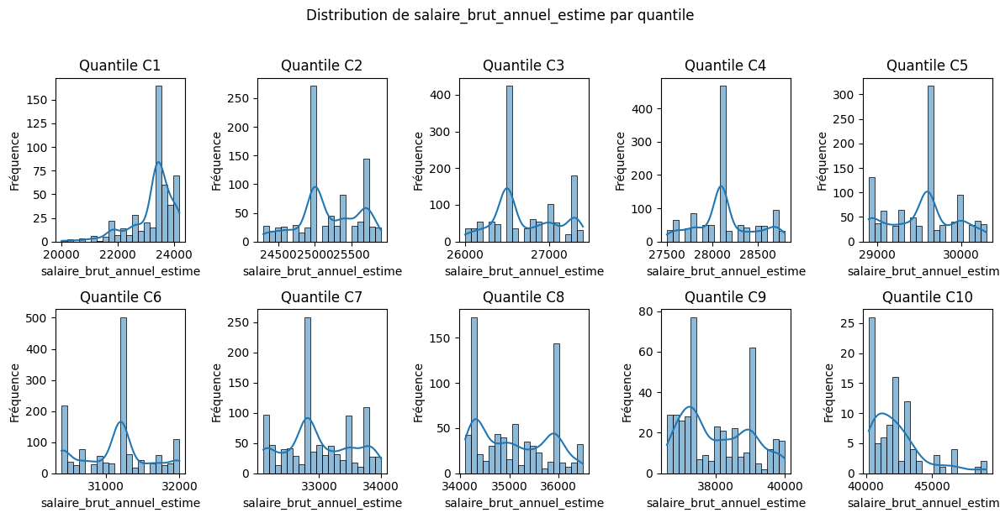

Absolument ! Analysons ce tableau concernant le salaire brut annuel estimé par catégorie de taux de réponse.

# 📊 Analyse du Salaire Brut Annuel Estimé Moyen par Catégorie de Taux de Réponse

Cette analyse examine le salaire brut annuel estimé moyen des diplômés employés, au sein de chaque catégorie de taux de réponse (C1 à C10). Les résultats mettent en évidence la progression salariale en fonction du taux de participation à l'enquête.

-----

## 🔢 Données statistiques

**Tableau des indicateurs par catégorie (en euros) :**

| Catégorie | Observations | Moyenne   | Médiane   | Minimum   | Maximum   |
|-----------|--------------|-----------|-----------|-----------|-----------|
| C1        | 476          | 23 273    | 23 400    | 20 000    | 24 200    |
| C2        | 873          | 25 189    | 25 100    | 24 300    | 25 900    |
| C3        | 1 231        | 26 708    | 26 500    | 26 000    | 27 400    |
| C4        | 1 139        | 28 135    | 28 100    | 27 500    | 28 800    |
| C5        | 1 032        | 29 538    | 29 600    | 28 900    | 30 300    |
| C6        | 1 391        | 31 125    | 31 200    | 30 400    | 32 000    |
| C7        | 1 036        | 32 985    | 32 800    | 32 100    | 34 000    |
| C8        | 755          | 35 100    | 35 000    | 34 100    | 36 500    |
| C9        | 417          | 38 035    | 37 800    | 36 600    | 40 000    |
| C10       | 924          | 42 322    | 42 000    | 40 200    | 49 100    |

*Note : Le salaire brut annuel est estimé en euros pour les diplômés ayant un emploi, regroupés par catégorie de taux de réponse à l'enquête.*

-----

## 🎯 Principaux constats

### 1\. Progression significative du salaire brut annuel estimé moyen par catégorie

  - **Augmentation notable** du salaire moyen de la catégorie C1 (23 273 €) à la catégorie C10 (42 322 €).
  - **Progression constante et relativement linéaire**, avec une accélération plus marquée dans les dernières catégories (C9 et C10).

### 2\. Nombre d'observations important dans les catégories intermédiaires

  - **Nombre d'observations conséquent** dans la plupart des catégories, assurant une certaine fiabilité des moyennes.
  - **Nombre d'observations plus faible** dans les catégories extrêmes (C1 et C9).

### 3\. Écart salarial croissant avec l'augmentation de la catégorie

  - **Faible étendue salariale** dans les premières catégories (environ 4 200 € pour C1 et 1 600 € pour C2).
  - **Étendue salariale plus importante** dans les catégories supérieures, notamment C10 (8 900 €), suggérant une plus grande dispersion des salaires pour les établissements ayant un taux de réponse très élevé.

-----

## 🏫 Implications méthodologiques

### Pour l'interprétation des salaires

  - **Les diplômés des établissements ayant un faible taux de réponse (C1) ont un salaire brut annuel estimé moyen significativement plus bas.**
  - **Le salaire moyen augmente de manière progressive avec le taux de réponse des établissements**, indiquant une corrélation positive entre la participation à l'enquête et le niveau de rémunération des diplômés.
  - **La plus grande dispersion salariale dans la catégorie C10** pourrait refléter une plus grande diversité des formations ou des secteurs d'emploi des diplômés de ces établissements très performants en termes de réponse.

### Pour l'orientation et l'accompagnement

  - **Mettre en évidence les différences de salaires moyens entre les catégories pour informer les futurs étudiants.**
  - **Analyser les facteurs qui contribuent à des salaires plus élevés dans les établissements des catégories supérieures.**

-----

## 📈 Visualisation recommandée

*Fig. 1 - Graphique en barres montrant la progression du salaire brut annuel estimé moyen par catégorie de taux de réponse.*
 

-----

## 🔍 Pistes d'approfondissement

1.  **Analyse par domaine de formation** :

      - Les tendances salariales par catégorie de réponse varient-elles selon les disciplines enseignées ?

2.  **Prise en compte de l'ancienneté** :

      - Le salaire estimé est-il basé sur le premier emploi après diplomation ou sur une situation plus tardive ?

3.  **Comparaison avec le niveau de qualification des emplois** (tableau précédent) :

      - Le salaire plus élevé dans les catégories supérieures est-il lié à une plus grande proportion d'emplois cadres ?

-----

### 💡 Insight clé

Ce tableau révèle une **corrélation positive claire et significative entre le taux de réponse des établissements et le salaire brut annuel estimé moyen de leurs diplômés**. Les établissements qui obtiennent une forte participation à leurs enquêtes semblent former des diplômés qui accèdent à des emplois mieux rémunérés. L'augmentation progressive du salaire moyen et l'étendue salariale croissante dans les catégories supérieures sont des éléments importants à considérer pour comprendre le lien entre la participation aux enquêtes et la réussite professionnelle des diplômés.
