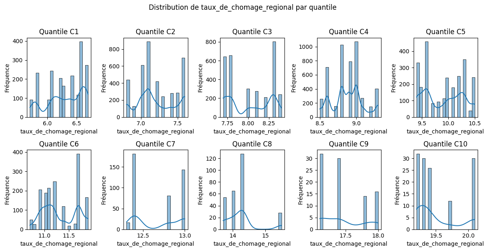

# 📊 Analyse du Taux de Chômage Régional Moyen par Catégorie de Taux de Réponse

Cette analyse examine le taux de chômage régional moyen des zones où se situent les établissements, au sein de chaque catégorie de taux de réponse (C1 à C10). L'objectif est d'observer si le contexte économique régional varie en fonction du niveau de participation des établissements aux enquêtes.

-----

## 🔢 Données statistiques

**Tableau des indicateurs par catégorie (en pourcentage) :**

| Catégorie | Observations | Moyenne | Médiane | Minimum | Maximum |
|-----------|--------------|---------|---------|---------|---------|
| C1        | 203          | 6.30%   | 6.35%   | 5.7%    | 6.7%    |
| C2        | 399          | 7.21%   | 7.16%   | 6.8%    | 7.6%    |
| C3        | 313          | 8.03%   | 8.00%   | 7.7%    | 8.4%    |
| C4        | 483          | 8.88%   | 8.90%   | 8.5%    | 9.3%    |
| C5        | 255          | 9.91%   | 10.0%   | 9.4%    | 10.5%   |
| C6        | 165          | 11.32%  | 11.2%   | 10.7%   | 11.9%   |
| C7        | 423          | 12.68%  | 12.8%   | 12.3%   | 13.0%   |
| C8        | 275          | 14.23%  | 14.3%   | 13.7%   | 15.5%   |
| C9        | 92           | 17.46%  | 17.4%   | 17.1%   | 18.0%   |
| C10       | 130          | 19.52%  | 19.4%   | 19.2%   | 20.1%   |

*Note : Le taux de chômage régional est la moyenne du taux de chômage des régions où se situent les établissements de chaque catégorie.*

-----

## 🎯 Principaux constats

### 1\. Progression marquée du taux de chômage régional moyen par catégorie

  - **Augmentation significative** du taux de chômage régional moyen de la catégorie C1 (6.30%) à la catégorie C10 (19.52%).
  - **Tendance claire à une augmentation du taux de chômage régional moyen à mesure que le taux de réponse des établissements augmente.**

### 2\. Nombre d'observations variable selon les catégories

  - **Nombre d'observations relativement faible** dans les catégories extrêmes (C9 et C10).
  - **Nombre d'observations plus important** dans les catégories intermédiaires (C2, C3, C4, C7).

### 3\. Faible étendue du taux de chômage régional au sein de chaque catégorie

  - **Étendue relativement limitée** du taux de chômage régional au sein de chaque catégorie (environ 0.4 à 1.8 points), suggérant une certaine homogénéité des contextes régionaux pour les établissements ayant des taux de réponse similaires.

-----

## 🏫 Implications méthodologiques

### Pour l'interprétation des taux d'insertion

  - **Les établissements ayant un faible taux de réponse (C1) sont situés en moyenne dans des régions avec un taux de chômage plus faible.** Cela pourrait potentiellement faciliter l'insertion de leurs diplômés, malgré leur faible participation aux enquêtes.
  - **Les établissements ayant un taux de réponse élevé (C9 et C10) sont situés en moyenne dans des régions avec un taux de chômage beaucoup plus élevé.** Leur performance en termes de taux d'insertion (vu dans un tableau précédent) est d'autant plus remarquable dans ce contexte économique plus difficile.

### Pour l'analyse des déterminants de l'insertion

  - **Le contexte économique régional semble être un facteur important à considérer lors de l'analyse des taux d'insertion et des autres indicateurs.**
  - **Il pourrait être intéressant de normaliser les taux d'insertion en fonction du taux de chômage régional pour obtenir une mesure de la performance "nette" des établissements.**

-----

## 📈 Visualisation recommandée

*Fig. 1 - Graphique en barres montrant la progression du taux de chômage régional moyen par catégorie de taux de réponse.*
 

-----

## 🔍 Pistes d'approfondissement

1.  **Analyse de la corrélation** :

      - Existe-t-il une corrélation significative entre le taux de réponse des établissements et le taux de chômage régional moyen des zones où ils sont situés ?

2.  **Étude de l'impact du contexte régional sur l'insertion** :

      - Comment le taux de chômage régional influence-t-il le taux d'insertion, le type d'emploi et le salaire des diplômés par catégorie de réponse ?

3.  **Comparaison intra-catégorie** :

      - Y a-t-il une variabilité significative des taux d'insertion au sein d'une même catégorie d'établissements situés dans des régions avec des taux de chômage différents ?

-----

### 💡 Insight clé

Ce tableau révèle une **tendance surprenante : les établissements avec les taux de réponse les plus élevés sont situés en moyenne dans des régions avec un taux de chômage plus élevé.** Cela suggère que la performance des établissements en termes d'insertion (observée précédemment) n'est pas uniquement due à un contexte économique favorable et pourrait même indiquer une plus grande efficacité de leurs dispositifs d'accompagnement. Il est crucial de prendre en compte ce facteur régional lors de l'interprétation des résultats d'insertion.
