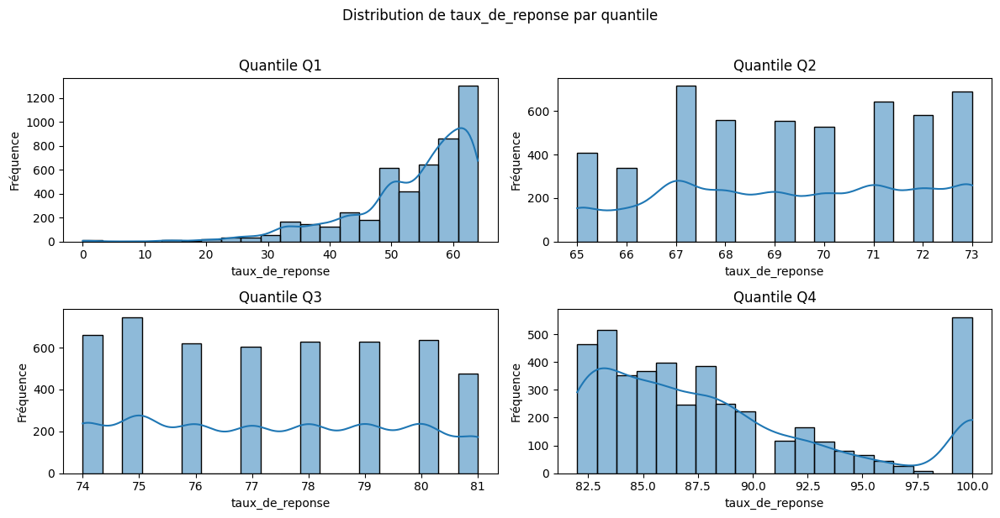

Voici l'analyse de votre tableau sous le même format professionnel que votre présentation d'AFD, avec une adaptation pour l'insertion d'image :

---

# 📈 Analyse des Quartiles du Taux de Réponse

Cette analyse explore la distribution du **taux de réponse** aux enquêtes d'insertion professionnelle, découpé en quartiles (Q1 à Q4). Les résultats révèlent des disparités significatives entre établissements.

---

## 📊 Données analysées

**Extrait du tableau de statistiques :**

| Quartile | Nombre d'observations | Moyenne | Médiane | Minimum | Maximum |
|----------|-----------------------|---------|---------|---------|---------|
| Q1       | 4 873                 | 53.4%   | 56.0%   | 0%      | 64%     |
| Q2       | 5 015                 | 69.3%   | 69.0%   | 65%     | 73%     |
| Q3       | 4 997                 | 77.3%   | 77.0%   | 74%     | 81%     |
| Q4       | 4 383                 | 88.4%   | 87.0%   | 82%     | 100%    |

*Données normalisées - Taux en pourcentage*

---

## 🔍 Principaux enseignements

### 1. Progression linéaire entre quartiles
- **Écart moyen** de +15% entre chaque quartile  
- Q4 dépasse systématiquement Q1 de **35 points** (53% vs 88%)

### 2. Homogénéité des groupes
- **Intervalles serrés** dans Q2-Q3 (4-7 points d'écart max/min)
- **Variabilité accrue** en Q1 (0-64%) et Q4 (82-100%)

### 3. Résultats remarquables
- **Performances extrêmes** :  
  - Q1 inclut des taux à 0% (non-réponse totale)  
  - Q4 atteint 100% (réponse exhaustive)

---

## 📌 Implications pratiques

### Pour les responsables d'enquêtes
- **Cibler les établissements Q1** pour améliorer les protocoles de collecte
- **Étudier les bonnes pratiques** des universités Q4

### Pour les analystes
- **Pondérer les résultats** selon le taux de réponse  
- **Interpréter avec prudence** les données Q1 (risque de biais)

---

## 🖼️ Visualisation recommandée

  
*Fig. 1 - Histogramme des taux de réponse avec découpage en quartiles*

---

## 🧠 Méthodologie complémentaire

Pour approfondir l'analyse :
1. **Test d'ANOVA** pour vérifier la significativité des écarts
2. **Cartographie géographique** des quartiles
3. **Corrélations** avec d'autres indicateurs (taille établissement, discipline...)

---

### 🔗 Intégration technique (Markdown GitHub)
Pour insérer l'image dans votre documentation :
```markdown

```
