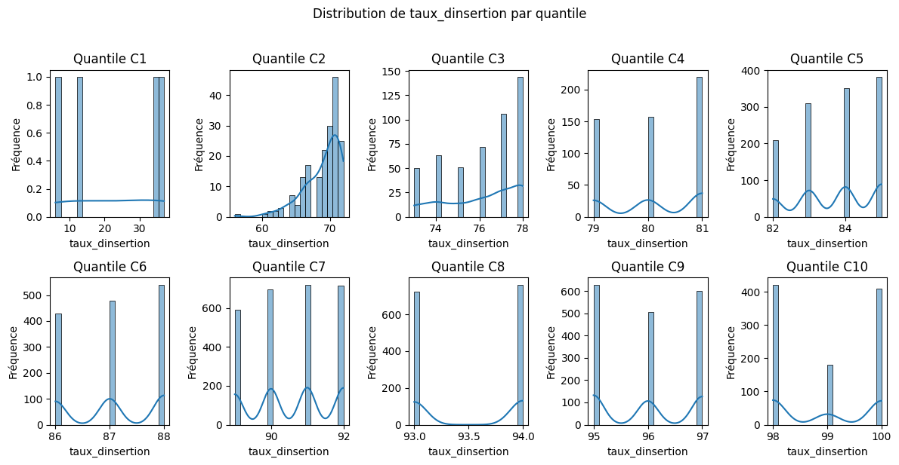

# 📊 Analyse du Taux d'Insertion Professionnelle Moyen par Catégorie de Taux de Réponse

Cette analyse examine le taux d'insertion professionnelle moyen au sein de chaque catégorie de taux de réponse (C1 à C10). Les résultats mettent en évidence la progression de ce taux en fonction de la catégorie de participation à l'enquête.

-----

## 🔢 Données statistiques

**Tableau des indicateurs par catégorie :**

| Catégorie | Observations | Moyenne | Médiane | Minimum | Maximum |
|-----------|--------------|---------|---------|---------|---------|
| C1        | 42           | 22.5%   | 23.5%   | 6.0%    | 37.0%   |
| C2        | 186          | 68.9%   | 70.0%   | 56.0%   | 72.0%   |
| C3        | 486          | 76.1%   | 77.0%   | 73.0%   | 78.0%   |
| C4        | 531          | 80.1%   | 80.0%   | 79.0%   | 81.0%   |
| C5        | 1,251        | 83.7%   | 84.0%   | 82.0%   | 85.0%   |
| C6        | 1,447        | 87.1%   | 87.0%   | 86.0%   | 88.0%   |
| C7        | 2,721        | 90.6%   | 91.0%   | 89.0%   | 92.0%   |
| C8        | 1,483        | 93.5%   | 94.0%   | 93.0%   | 94.0%   |
| C9        | 1,735        | 96.0%   | 96.0%   | 95.0%   | 97.0%   |
| C10       | 1,012        | 99.0%   | 99.0%   | 98.0%   | 100.0%  |

*Note : Le taux d'insertion professionnelle mesure le pourcentage de diplômés ayant trouvé un emploi après leur formation, regroupés ici par catégorie de taux de réponse à l'enquête.*

-----

## 🎯 Principaux constats

### 1\. Forte progression du taux d'insertion professionnelle moyen par catégorie

  - **Augmentation significative** du taux d'insertion moyen de la catégorie C1 (22.5%) à la catégorie C10 (99.0%).
  - **Sauts importants** entre les premières catégories (C1 à C2) et une progression plus graduelle ensuite.

### 2\. Distribution des observations concentrée dans les catégories intermédiaires et supérieures

  - **Nombre d'observations faible** dans la catégorie C1.
  - **Forte concentration** dans les catégories C5, C6, C7 et C8.

### 3\. Réduction de l'étendue du taux d'insertion au fur et à mesure des catégories

  - **Très grande dispersion** dans la catégorie C1 (étendue de 31 points).
  - **Étendue très faible** dans les catégories supérieures (seulement 1 ou 2 points pour C4, C8, C9, C10), indiquant une forte homogénéité du taux d'insertion pour les établissements ayant un taux de réponse élevé.

-----

## 🏫 Implications méthodologiques

### Pour l'interprétation des résultats d'insertion

  - **Les établissements ayant un faible taux de réponse à l'enquête (C1) présentent également un taux d'insertion professionnelle moyen beaucoup plus faible et une plus grande variabilité.** Cela soulève des questions sur la représentativité des données de cette catégorie.
  - **Les établissements ayant un taux de réponse élevé (C8, C9, C10) affichent des taux d'insertion professionnelle très élevés et relativement homogènes.**

### Pour la stratégie d'enquête

  - **Il semble exister une corrélation positive entre le taux de réponse à l'enquête et le taux d'insertion professionnelle déclaré.** Cela pourrait indiquer que les établissements les plus performants en termes d'insertion sont également plus enclins à participer aux enquêtes.

-----

## 📈 Visualisation recommandée

*Fig. 1 - Graphique en barres montrant la progression du taux d'insertion professionnelle moyen par catégorie de taux de réponse.*
 

-----

## 🔍 Pistes d'approfondissement

1.  **Analyse des facteurs** expliquant la faible insertion dans la catégorie C1 :

      - Caractéristiques des formations concernées.
      - Contexte socio-économique des diplômés.

2.  **Étude de la causalité** :

      - Le taux de réponse élevé est-il une conséquence d'un bon taux d'insertion, ou les établissements bien organisés favorisent-ils à la fois la participation aux enquêtes et l'insertion de leurs diplômés ?

3.  **Comparaison avec d'autres indicateurs de qualité** :

      - Relation entre le taux d'insertion par catégorie et d'autres mesures de la performance des établissements.

-----

### 💡 Insight clé

Ce tableau met en lumière une **forte association positive entre le taux de réponse à l'enquête et le taux d'insertion professionnelle moyen des établissements**. Les établissements qui mobilisent le mieux leurs diplômés pour répondre aux enquêtes semblent également obtenir de meilleurs résultats en termes d'insertion. La **grande hétérogénéité du taux d'insertion dans la catégorie C1** est particulièrement préoccupante et mériterait une investigation plus approfondie.
